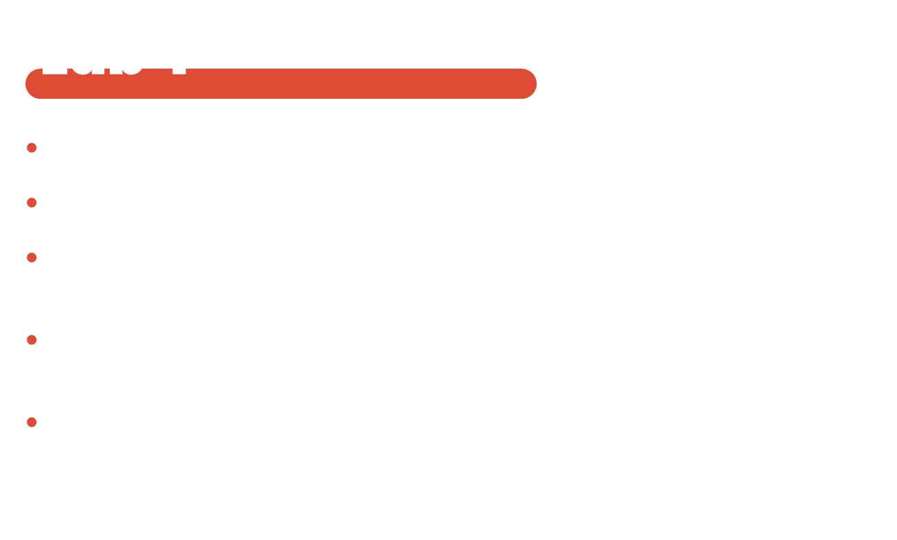

# ITI-Version-Control

This is lab 1 for version control

  
<h1>Lab1</h1>

# Day 1 VC

### What is Git?

Git is a distributed version control system that tracks versions of files. It is often used to control source code by developers developing software collaboratively.
Git is the same as GitHub? False

### What is the command to get the installed version of Git?

git --version

### Which option should you use to set the default user name for every repository on your computer?

--global

### What is the command to set the user email for the current repository?

git config user.email

### What is the command to add all files and changes of the current folder to the staging environment of the Git repository?

git add –all

### What is the command to get the current status of the Git repository?

git status

### What is the command to initialize Git on the current repository?

git init

### Git automatically adds new files to the repository and starts tracking them.? False

### What is the command to commit the staged changes for the Git repository?

git commit -m

### What is the command to commit with the message "New email":

git commit -m “New Email”

### What is the command to view the history of commits for the repository?

git log
In Git, a branch is:  
A separate version of the main repository

### What is the command to create a new branch named "new-email"?

Git branch new-email
Git checkout -b new-email

### What is the command to move to the branch named "new-email"?

Git checkout new-email

### What is the command to merge the current branch with the branch "new-email"?

Git checkout main
Git merge new-email

# day2-Version-Control

### 1-Make a project deployment.

### 2-what is pull request and request & differrent bettween them?

Pull Request (PR): A pull request is a feature in Git hosting services (like GitHub, GitLab) that allows you to notify others about changes you've pushed to a branch in a repository. Once a pull request is opened, reviewers can discuss and review the potential changes before merging them into the main branch.

Request: This term is a bit vague, but it could refer to a general request for changes or updates in a project, not necessarily tied to a specific Git feature.

Difference: A pull request is a specific Git feature for code review and merging, while a request could be any general request for changes or updates.

### 3-Make fork from your project and use it from anthor account

### 4-What is the command to delete the branch "new-email"

`git branch -d new-email`
`git push origin --delete new-email`

### 5-What is the command to push the current repository to the remote origin?

`git push origin <branch-name>`

### 6-what is git Rebase and how to use it ?

**Git Rebase** is a command that allows you to move or combine a sequence of commits to a new base commit.
`git checkout feature-branch`
`git rebase main`

### 7-What is the command to get all the change history of the remote repository "origin"?

`git fetch origin`

### 8-What is the command to show the differences between the current branch and the branch "new-email"?

`git diff new-email`

### 9-what is tags and Make five tags and release two of them?

`git tag v1.0.0`
`git tag v2.0.0`
`git tag v3.0.0`
`git tag v4.0.0`
`git tag v5.0.0`

`git push origin --tags`

### Bouns :

### Make SSh to your repo.
